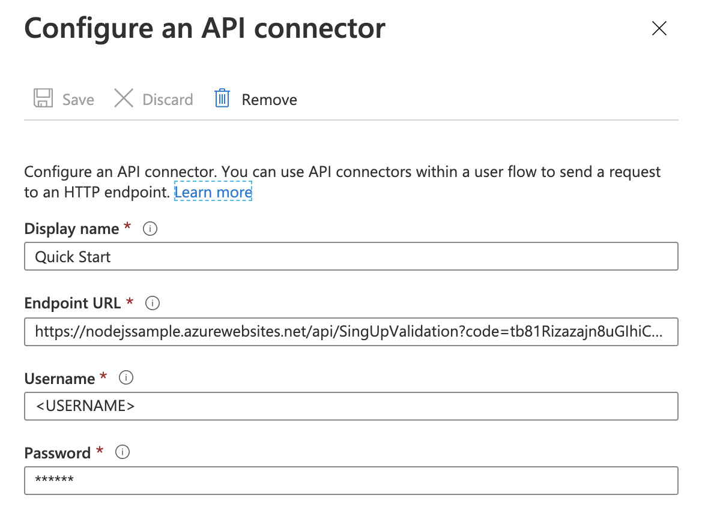

# User flow sign-up customization using C# .NET Core Azure Function and API connectors

This sample demonstrates how to use API connectors to customize sign-up for Azure AD [guest user self-service sign-up](https://docs.microsoft.com/azure/active-directory/b2b/self-service-sign-up-overview) and [Azure AD B2C sign-up user flows](https://docs.microsoft.com/azure/active-directory-b2c/tutorial-create-user-flows).
In particular, the sample demonstrates how to:

1. Limit external user sign-ups to only a particular federated Azure Active Directory tenant. In this example, it's a fictitious `fabrikam.com` and `fabricam.com`.
1. Validate a user-provided value `Display Name` against a validation rule.

The API is implemented using an Azure Function HTTP trigger in C# .NET Core.

## Contents

| File/folder                 | Description                                |
| --------------------------- | ------------------------------------------ |
| [SignUpValidation.cs](SignUpValidation.cs)      | Sample source code for HTTP trigger.       |
| [ResponseContent.cs](ResponseContent.cs)      | HTTP response content.       |
| `.gitignore`                | Define what to ignore at commit time.      |
| `CHANGELOG.md`              | List of changes to the sample.             |
| `CONTRIBUTING.md`           | Guidelines for contributing to the sample. |
| `README.md`                 | This README file.                          |
| `LICENSE`                   | The license for the sample.                |

## Key concepts

API connectors provide you with a way to modify and extend sign-up flows by leveraging web APIs. API connectors are available in both [guest user self-service sign up](https://docs.microsoft.com/azure/active-directory/external-identities/api-connectors-overview) and [Azure AD B2C sign-up user flows](https://docs.microsoft.com/azure/active-directory-b2c/api-connectors-overview?pivots=b2c-user-flow).

This examples uses an API connector to limit sign-ups to only specific email domains, fabrikam.com and fabricam.com. This is easily modifiable in `SignUpValidation.cs` and can be extended limit sign ups to any particular email domain or set of email domains. Further, the API connector in this sample is used to perform input validation on `Display Name` by ensuring a user provides a value of at least 4 characters.

This sample uses an Azure Function as the web API endpoint but you can alternatively edit the `.cs` files in your preferred IDE and deploy that code in any web service. If so, environment variables used for authentication may work differently.

## Prerequisites

Before you get started, make sure you have the following requirements in place:

- An Azure account with an active subscription. [Create an account for free](https://azure.microsoft.com/free/?ref=microsoft.com&utm_source=microsoft.com&utm_medium=docs&utm_campaign=visualstudio).
- A [self-service sign-up user flow](https://docs.microsoft.com/azure/active-directory/b2b/self-service-sign-up-user-flow) in an Azure AD tenant or a [sign-up or sign-in user flow](https://docs.microsoft.com/azure/active-directory-b2c/tutorial-create-user-flows) in an Azure AD B2C tenant.
- Install [.NET Core 3.1](https://dotnet.microsoft.com/download/dotnet-core/3.1). The ASP.NET Core Runtime enables you to run existing web/server applications.
- Install [Visual Studio code](https://code.visualstudio.com). A free source-code editor made by Microsoft for Windows, Linux and macOS. Features include support for debugging, syntax highlighting, intelligent code completion, snippets, code refactoring, and embedded Git.
- The [Azure Functions extension](https://marketplace.visualstudio.com/items?itemName=ms-azuretools.vscode-azurefunctions) for Visual Studio Code.

## Setting up your Azure Function

### Steps to run locally

1. Clone the repository

```console
git clone https://github.com/Azure-Samples/active-directory-dotnet-external-identities-api-connector-azure-function-validate
```

1. Navigate to the **Azure extension** in Visual Studio code on the left navigation bar. You should see a 'Local Project' folder representing your local Azure Function.
1. Press **F5** (or use the **Debug > Start Debugging** menu command) to launch the debugger and attach to the Azure Functions host. (This command automatically uses the single debug configuration that Azure Functions created.)
1. The Azure Function extension will automatically generate a few files for local development, install dependencies, and install the Function Core tools if not already present. These tools help with the debugging experience.
1. Output from the Functions Core tools appears in the VS Code **Terminal** panel. Once the host has started, **Alt+click** the local URL shown in the output to open the browser and run the function. You can also see the url of the Local Function by right clicking on the function on the Azure Functions explorer.
1. To redeploy the local instance during testing, just repeat these steps.

### Add authentication

Authentication is stored in environment variables, so they're not stored as part of the repository and should never be stored in checked in code. Read more about the [local.settings.json](https://docs.microsoft.com/azure/azure-functions/functions-run-local?tabs=macos%2Ccsharp%2Cbash#local-settings-file) file.

1. Create a [local.settings.json](local.settings.json) file
1. Add the `BASIC_AUTH_USERNAME` and the `BASIC_AUTH_PASSWORD` setting.
1. You final local.settings.json should look like following one:

```json
{
  "IsEncrypted": false,
  "Values": {
    "AzureWebJobsStorage": "",
    "FUNCTIONS_WORKER_RUNTIME": "dotnet",
    "BASIC_AUTH_USERNAME": "<USERNAME>",
    "BASIC_AUTH_PASSWORD": "<PASSWORD>"
  }
}
```

Specify a **Username** and **Password**. This will be what your Azure Function uses to authenticate incoming requests.

### Deploy the application

1. Follow steps of [this](https://docs.microsoft.com/azure/azure-functions/functions-develop-vs-code?tabs=csharp#publish-to-azure) guide to deploy your Azure Function to the cloud. Copy the endpoint web URL of your Azure Function.
1. Once deployed, you'll see a **'Upload settings'** option. Select this. It will upload your environment variables onto the [Application settings](https://docs.microsoft.com/azure/azure-functions/functions-develop-vs-code?tabs=csharp#application-settings-in-azure) of the cloud.

To learn more about Visual Studio Code development for Azure Functions, see [this](https://docs.microsoft.com/azure/azure-functions/functions-dotnet-class-library).

## Configure and enable the API connector

Follow the steps outlined in "Add an API connector" for [guest user self-service sign-up](https://docs.microsoft.com/azure/active-directory/external-identities/self-service-sign-up-add-api-connector) or for [Azure AD B2C](https://docs.microsoft.com/azure/active-directory-b2c/add-api-connector) to create an API connector and enable it your user flow. The end result is shown below.

### API connector configuration

Your API connector configuration should look like the following:



- **Endpoint URL** is the Function URL you copied earlier.
- **Username** and **Password** are the Username and Passwords you defined as environment variables earlier.

### Enable the API connector

In the **API connector** settings for your user flow, you can select the API connector to be invoked at either step:


- **After signing in with an identity provider** - if enabled for this step, the API connector will only allow users with an email ending in `@fabrikam.com`. Note that for Azure AD B2C, this does not apply to local accounts.
- **Before creating the user** - if enabled for this step, the API connector will only allow users with an email ending in `@fabrikam.com` _and_ check whether the `Display Name` attribute is of at least length 5. Note, the `Display Name` has to be selected in **User attributes** for the user flow.

## Customizing the Azure Function

This sample provides a quick way to get started using API connectors. By modifying the source code and leveraging all the capabilities of a web API you're used to, you'll be able to accomplish many more complex scenarios including integration with other web APIs and services.

## Contributing

This project welcomes contributions and suggestions. Most contributions require you to agree to a
Contributor License Agreement (CLA) declaring that you have the right to, and actually do, grant us
the rights to use your contribution. For details, visit <https://cla.opensource.microsoft.com.>

When you submit a pull request, a CLA bot will automatically determine whether you need to provide
a CLA and decorate the PR appropriately (e.g., status check, comment). Simply follow the instructions
provided by the bot. You will only need to do this once across all repos using our CLA.

This project has adopted the [Microsoft Open Source Code of Conduct](https://opensource.microsoft.com/codeofconduct/).
For more information see the [Code of Conduct FAQ](https://opensource.microsoft.com/codeofconduct/faq/) or
contact [opencode@microsoft.com](mailto:opencode@microsoft.com) with any additional questions or comments.
